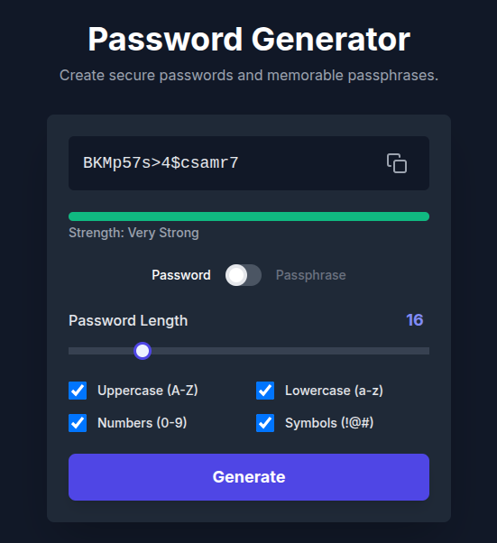
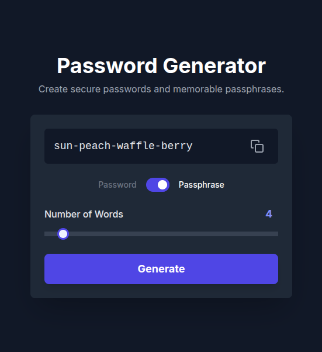

# Password & Passphrase Generator 🔐

A sleek, modern, and responsive web application for creating strong, secure passwords and memorable passphrases. This tool is built with vanilla HTML, CSS, and JavaScript, and styled with Tailwind CSS.

## ✨ Features

This generator provides a simple yet powerful interface with the following key features:

-   **Dual Generation Modes**: Seamlessly switch between a classic random character **password generator** and a word-based **passphrase generator**.
-   **Highly Customizable Passwords**:
    -   **Adjustable Length**: Choose a password length from 8 to 50 characters using an intuitive slider.
    -   **Character Sets**: Easily include or exclude uppercase letters (A-Z), lowercase letters (a-z), numbers (0-9), and symbols (!@#$...).
-   **Memorable Passphrases**:
    -   Generate easy-to-remember passphrases using a predefined wordlist.
    -   Adjust the number of words from 3 to 20.
-   **Password Strength Meter**: Get instant visual feedback on the strength of your generated password, categorized as Weak, Medium, Strong, or Very Strong.
-   **One-Click Copy**: A convenient button to copy the generated password or passphrase to your clipboard with visual confirmation.
-   **Responsive Design**: The user interface is fully responsive and works beautifully on devices of all sizes, from mobile phones to desktop computers.
-   **No Dependencies**: This is a single-file application that runs directly in the browser without any need for installation or build steps.

## 🛠️ Technologies Used

-   **HTML5**: For the basic structure and content.
-   **Tailwind CSS**: For a modern, utility-first styling approach (used via CDN).
-   **Vanilla JavaScript**: For all the logic, including generation algorithms, UI interactions, and DOM manipulation.
-   **Google Fonts**: For the clean 'Inter' typeface.

## Screenshots 📸

### Password

### Passphrase

## 🚀 Getting Started

All you need is a modern web browser (like Chrome, Firefox, Safari, or Edge).

1. Visit [Password Generator](https://getpassword.rishabhtomar.com)

## ⚙️ How It Works

The application's logic is contained within the `<script>` tag in the `index.html` file.

-   **Mode Toggling**: A checkbox input is used to toggle the visibility of the password and passphrase option containers. The UI and generator function are updated accordingly.
-   **Password Generation**: When in "Password" mode, the generator builds a string of random characters based on the user's selected criteria (length, uppercase, lowercase, numbers, symbols). The final string is then shuffled to ensure randomness.
-   **Passphrase Generation**: In "Passphrase" mode, the generator randomly selects a specified number of words from a built-in `wordList` array and joins them together with a hyphen.
-   **Strength Calculation**: The password strength is calculated based on a scoring system that considers its length and the inclusion of different character types (e.g., uppercase, numbers, symbols). The score determines the color and width of the strength bar.

## License 📄

This project is licensed under the MIT [License](LICENSE).